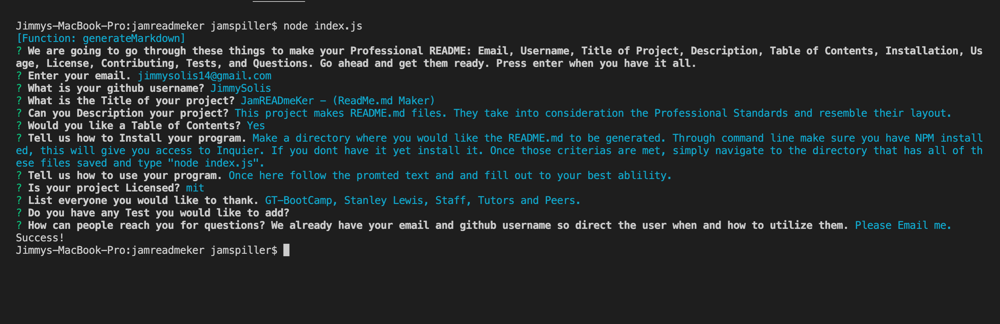

# JamREADmeKer - (ReadMe.md Maker) 
   

  ## Description
  This project makes README.md files. They take into consideration the Professional Standards and resemble their layout.

  ## Table of Contents 
  - [Installation](#installation)
  - [Usage](#usage)
  - [Credits](#credits)
  - [License](#license) 

  ## Installation
  Make a directory where you would like the README.md to be generated. Through command line make sure you have NPM installed, this will give you access to Inquier. If you dont have it yet install it. Once those criterias are met, simply navigate to the directory that has all of these files saved and type "node index.js".

  ## Usage
  Once here follow the promted text and and fill out to your best ablility. 

  ## Credits
  GT-BootCamp, Stanley Lewis, Staff, Tutors and Peers.

  ## Questions
  Here is my email for questions:  jimmysolis14@gmail.com
   
  If you would like to look me up in github, here is my username: JimmySolis
   
  Follow these instructions to contact me:  
  Please Email me.

  ## Run Through

 1)  Lets begin with the prompt that pops up:

  

  Once the program is downloaded, run node index.js. This will bring up these question.

 2) 
  

 3) In order to be able to access this we need to have node, inquire and our function in a different js file to work.

 

 4) Then we make node give use the ality to write a new file, in this case README.md. We pass the data collected through the generateMarkdown funcition.

 

 5) If we look at the generateMarkdown funcition we can see we take the info to know if we should make a license section in the read me. 
 
 

 6) With in the same function we use string interpolation to plan out how the layout of the README.md file should look.

 

Click link for video:
(https://drive.google.com/file/d/1Nv-n9dKh7vi7jBvW7NZBUIHB45yvu3tm/view?usp=sharing)
  